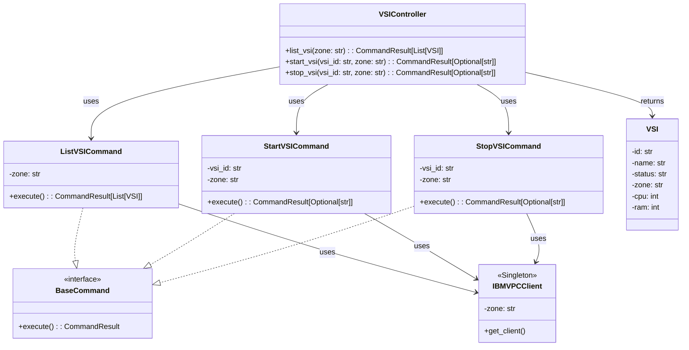

# 🧠 Architecture Overview

This document describes the design and structure of the **IBM Cloud VM Controller** codebase.

---

## 🧩 Structure Overview

The project follows a clean and modular structure inspired by software architecture best practices:

### 📁 Project Structure: IBM Cloud VM Controller

```
src/
├── dtos/                          # 📨 Data Transfer Objects (typed data models)
│   └── vsi.py                     #    - VSI: represents a Virtual Server Instance
│
├── services/                      # ⚙️ Service layer
│   ├── vsi_controller.py          #    - VSIController: main interface to manage VSIs (list/start/stop)
│
│   └── commands/                  # 🧠 Command pattern implementations
│       ├── base.py                #    - BaseCommand + CommandResult definitions
│       ├── list.py                #    - ListVSICommand: lists all VSIs in a zone
│       ├── start.py               #    - StartVSICommand: starts a VSI by ID
│       ├── stop.py                #    - StopVSICommand: stops a VSI by ID
│       └── ibm_vpc_client.py      #    - IBMVPCClient: singleton factory for authenticated VPC client
```

---

## 🔧 Service Layer

At the core of the application lies the **service layer**, which is the main interface for client code or agents.

### `VSIController`

This class exposes the public methods:

- `list_vsi(zone: str)`
- `start_vsi(vsi_id: str, zone: str)`
- `stop_vsi(vsi_id: str, zone: str)`

These methods represent the available operations over IBM Cloud VSIs and internally delegate the logic to command classes.

---

## 🧱 Command Pattern

Each operation (`list`, `start`, `stop`) is implemented using the **Command Pattern**, allowing encapsulation of each request as a standalone object.

📖 Learn more about the pattern:
👉 [refactoring.guru/design-patterns/command](https://refactoring.guru/design-patterns/command)

Each command:

- Implements a common interface `BaseCommand`
- Is executed using the `execute()` method
- Returns a `CommandResult[T]` containing the result and status

---

## 📦 Data Transfer Objects (DTO)

The DTO layer defines structured objects for communication within the app.
Example: `VSI` is a data class used to represent the properties of a Virtual Server Instance in a consistent and typed way.

---

## 🧵 Singleton: IBMVPCClient

The class `IBMVPCClient` is implemented as a **Singleton**.

Its goal is to:

- Authenticate using the IBM Cloud API key (loaded from `.env`)
- Provide a single configured instance of the `VpcV1` client per zone

📖 Learn more about the Singleton Pattern:
👉 [refactoring.guru/design-patterns/singleton](https://refactoring.guru/design-patterns/singleton)

---

## 📊 Class Diagram

Here is a high-level class diagram using **PlantUML** syntax (you can preview it using [PlantUML Online Editor](https://www.planttext.com)):


